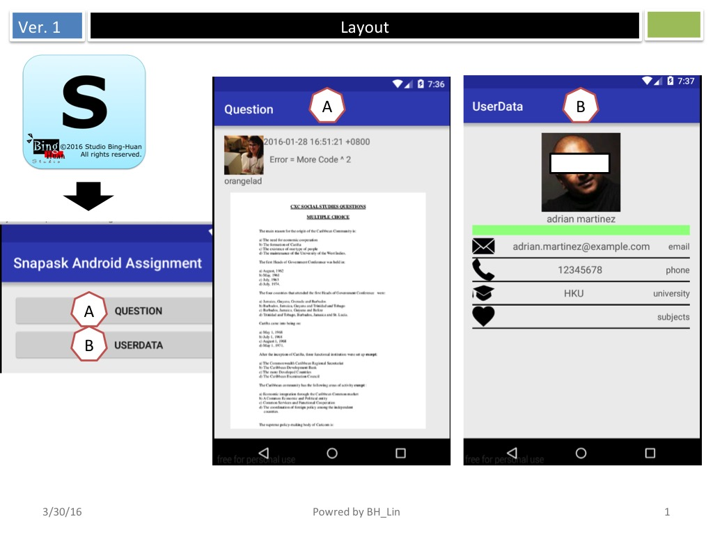

# SnapaskAndroidAssignment

 

## Design. 
 

## Demo. 
 <a href="https://youtu.be/qAy0zt2r7kU" target="_blank"> Watch the video on YouTube</a>

## Task 1: How to check the funtinality of data cache.
<ul>
<li>Launch app</li>
<li>Press button "QUESTION"</li>
<li>Check the responding time</li>
<li>Back to the main page</li>
<li>Press button "QUESTION"</li>
<li>Check the responding time</li>
</ul>
You will see the difference. 

## Task 2: How to test app deep link
Get into the folder "www", and host a local web server.  
Then, open the page "index.html" on device.  
 

Or just use adb command to test.  

adb shell am start 
        -W -a android.intent.action.VIEW 
        -d URI PACKAGE 
        

## Task 3: How to run unit test.
In project folder, execute following command

./gradlew test

### Then, you will see the result.

## Reference:

<h4>Enabling Deep Links for App Content</h4>
<a href="http://developer.android.com/intl/zh-tw/training/app-indexing/deep-linking.html">http://developer.android.com/intl/zh-tw/training/app-indexing/deep-linking.html</a>

  
Coding quest from "Snapask"
